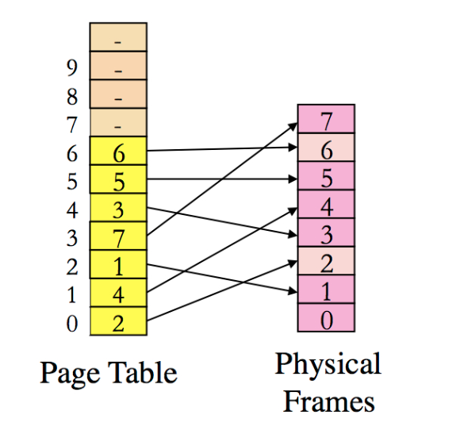

Project 1: Memory Management

Overview
This assignment is related to virutal memory management inside OS. You will practice the management of page table and physical memory allocation by emulating what happens inside the OS kernel. Since we can't operate on real hardware and at the OS level, this project will design a simulator. 
 
1K bytes physical memory, 12 bits (4096 bytes) of virtual address. Suppose that the size of virtual page/frame is 128 bytes (i.e., with 7 bits in the address as offset). Design a paging system that implements one-level page table. We only use one-level page table for simplicity. 

Part 1:
This is just to get you started. Assume that the page table of the process is like the following picture.
 

Note that only several entries of the process' page table are listed as we will only use the first 7 entries in Part 1. 

The program will take only one parameter, the name of sequence file , which contains a sequence of logical memory accesses. Here, each logical addresses is saved as 8 bytes (unisgned long). Your program should read and analyze each logical address, and translate it into the corresponding physical addresses based on the given page table as shown in the above picture. 

The logical memory address is saved in a binary format. Output the translated physical address into a new file called output-part1test file for the given part1testsequence file. Now test your code with part1sequence as the input file for the logical address sequence to generate the translated physical addresses and put them in another file called output-part1. Then you can utilize the md5sum to compute their corresponding checksum, and you only need to write corresponding checksum into "status.txt" file. 

Part 2:

In this part, you will be designing the page table and handling the physical memory management. You will create two new source files in this part: phypages.c and pagetable.c, and a new main program named as assign1part2.c, plus any necessary header files. Here, phypages.c is used to manage the physical pages and pagetable.c will manage the page table for the process. 

For this part, we also assume the same as above: the first physical frame/page is reserved for the OS, while other pages are freed initially. You will use a simple physical page allocation initially: 
you will allocate the physical page in the order of frame number, starting from 1, 2, 3, ....... If there are some physical pages that are available, you will always allocate from the free list at first. 

Once there is no free physical frame, you need to use one of the page replacement policies to choose a physical frame to free. We will use the LRU policy at first, which means the page that is least recently used (accessed) will be freed at first. 

Note that, once a frame is selected to be freed, you need to do two things:
(1) First, you should change the old entry of page table so that we don't have two virtual pages pointing to the same physical frame.
(2) Second, you need to change the entry of target page in the page table to point to the frame. At the same time, you may also set up the reverse mapping on the physical page so that we can find the page table entry when we will assign this frame to other entries.

If a page is just accessed recently, you should update the corresponding the placement of its physic frame so that this frame will not be evicted soon (based on the LRU policy).

Use input sequence file part2sequence, the program should generate the output file as output-part2. 

Similar to part 1, you will only need to report the md5sum checksum for the output file output-part2 and # of pagefaults. 

Part 3: Making your design to be adaptive to any situation

For this part, we do not assume the size of a page, size of virtual memory, size of physical memory. You will design a system that can be adaptive to any situation of these different parameters. To get the bonus points, you should list whether you have implemented part 3 in your "status.txt" file. Also, you should briefly explain how to implement this part in comparison to the first two parts. 

You should have a new main program named as assign1part3.c, and your program should accept the following parameters:

./assign1 BytesOfPage SizeOfVirtualMemory SizeOfPhysicalMemory SequenceFile 

where the first parameter BytesOfPage specifies the number of bytes in each physical frame and virtual page. The second parameter SizeOfVirtualMemory is the size of virtual memory in bytes. The third one SizeOfPhysicalMemory is the size of physical memory in bytes. The fourth one SequenceFile is the name of the file that contains the sequence of memory access logical addresses that need to be translated. 

To test your program's Part 3 functions, you can use the parameters specified in "Part 2", and your program should generate the same output file as output-part2.
